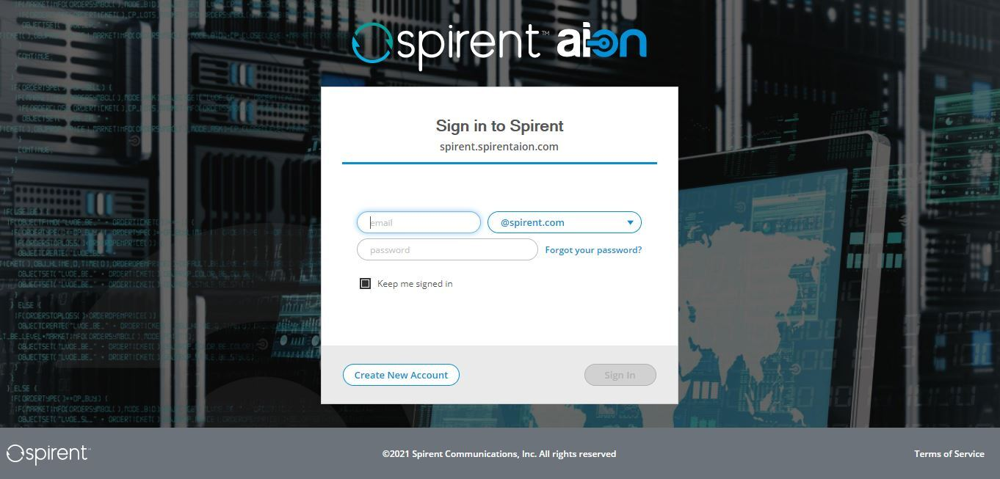

# Azure RM Spirent AION Platform Terraform

## Description

Run [Spirent AION](https://www.spirent.com/products/aion) platform instances.  After Terraform apply finishes you will be able to point your browser at the `instance_public_ips` addresses.

If you would like to configure the Spirent AION platform in a web browser set the variable `enable_provisioner=false`.  When `enable_provisioner=true` the instance will be configured.  However, license entitlement and product installation will need to be completed in your web browser (see below).  Login to the platform instance https://<your_public_ip> using the values of `admin_email` and `admin_password`.

### Add License Entitlements
1. From _Settings_  navigate to _License Manager_, _Entitlements_
2. Click _Install Entitlements_
3. Use one of the following methods to add entitlements (#1 is prefered)
   1. Login to <your_org>.spirentaion.com and select entitlements to host in the new instance\
      **Note:** Hosted entitlements should be released before destroying the instance.  When entitlements are not released you will need to contact Spirent support to release them for you.
   2. Install a license entitlement file obtained from Spirent support

### Add Products
1. From _Settings_  navigate to _Settings_, _Add New Products_
2. Click _Install New Products_
3. Select products and versions and click _Install_

<!-- BEGINNING OF PRE-COMMIT-TERRAFORM DOCS HOOK -->
## Requirements

| Name | Version |
|------|---------|
| terraform | >= 0.13.0 |
| azurerm | >=2.37.0 |

## Providers

| Name | Version |
|------|---------|
| azurerm | >=2.37.0 |
| null | n/a |
| template | n/a |

## Modules

No Modules.

## Resources

| Name |
|------|
| [azurerm_image](https://registry.terraform.io/providers/hashicorp/azurerm/latest/docs/data-sources/image) |
| [azurerm_linux_virtual_machine](https://registry.terraform.io/providers/hashicorp/azurerm/latest/docs/resources/linux_virtual_machine) |
| [azurerm_network_interface](https://registry.terraform.io/providers/hashicorp/azurerm/latest/docs/resources/network_interface) |
| [azurerm_network_interface_security_group_association](https://registry.terraform.io/providers/hashicorp/azurerm/latest/docs/resources/network_interface_security_group_association) |
| [azurerm_network_security_group](https://registry.terraform.io/providers/hashicorp/azurerm/latest/docs/resources/network_security_group) |
| [azurerm_public_ip](https://registry.terraform.io/providers/hashicorp/azurerm/latest/docs/resources/public_ip) |
| [null_resource](https://registry.terraform.io/providers/hashicorp/null/latest/docs/resources/resource) |
| [template_file](https://registry.terraform.io/providers/hashicorp/template/latest/docs/data-sources/file) |

## Inputs

| Name | Description | Type | Default | Required |
|------|-------------|------|---------|:--------:|
| admin\_email | Cluster admin user email. Use this to login to instance web page.  Default is obtained from AION user information. | `string` | `""` | no |
| admin\_first\_name | Cluster admin user first name. Default is obtained from AION user information. | `string` | `""` | no |
| admin\_last\_name | Cluster admin user last name.  Default is obtained from AION user information. | `string` | `""` | no |
| admin\_password | Cluster admin user password. Use this to login to the instance web page. | `string` | n/a | yes |
| admin\_username | Administrator user name. | `string` | n/a | yes |
| aion\_image\_name | AION image created from private vhd file.  This variable overrides the marketplace image. | `string` | `""` | no |
| aion\_password | AION user password for aion\_url | `string` | n/a | yes |
| aion\_url | AION URL | `string` | n/a | yes |
| aion\_user | AION user registered on aion\_url | `string` | n/a | yes |
| cluster\_names | Instance cluster names.  List length must equal instance\_count. | `list(string)` | `[]` | no |
| dest\_dir | Destination directory on the instance where provisioning files will be copied | `string` | `"~"` | no |
| enable\_provisioner | Enable provisioning.  When enabled instances will be initialized with the specified variables. | `bool` | `true` | no |
| http\_enabled | Allow HTTP access as well as HTTPS.  Normally this is not recommended. | `bool` | `false` | no |
| ingress\_cidr\_blocks | List of management interface ingress IPv4/IPv6 CIDR ranges. | `list(string)` | n/a | yes |
| instance\_count | Number of instances to create. | `number` | `1` | no |
| instance\_name | Name assigned to the AION instance.  An instance number will be appended to the name. | `string` | `"aion"` | no |
| instance\_size | The Azure Virtual Machine SKU. | `string` | n/a | yes |
| local\_admin\_password | Cluster local admin password for instance SSH access.  Will use admin\_password if not specified. | `string` | `""` | no |
| marketplace\_version | The Spirent AION image version (e.g. 0517.0.0). When not specified, the latest marketplace image will be used. | `string` | `"latest"` | no |
| metrics\_opt\_out | Opt-out of Spirent metrics data collection | `bool` | `false` | no |
| mgmt\_plane\_subnet\_id | Management public Azure subnet ID. | `string` | n/a | yes |
| node\_names | Instance cluster node names.  List length must equal instance\_count. | `list(string)` | `[]` | no |
| node\_storage\_provider | Cluster node storage provider | `string` | `"local"` | no |
| node\_storage\_remote\_uri | Cluster node storage URI.  Leave blank for default when provider is local | `string` | `""` | no |
| os\_disk\_size\_gb | Size of the OS disk in GB. When null size will be determined from the image. | `number` | `null` | no |
| private\_key | File path to private key | `string` | n/a | yes |
| public\_key | File path to public key. | `string` | n/a | yes |
| resource\_group\_location | RG location in Azure | `string` | n/a | yes |
| resource\_group\_name | RG name in Azure | `string` | n/a | yes |

## Outputs

| Name | Description |
|------|-------------|
| instance\_ids | List of instance IDs |
| instance\_private\_ips | List of private IP addresses assigned to the instances, if applicable |
| instance\_public\_ips | List of public IP addresses assigned to the instances, if applicable |
<!-- END OF PRE-COMMIT-TERRAFORM DOCS HOOK -->
